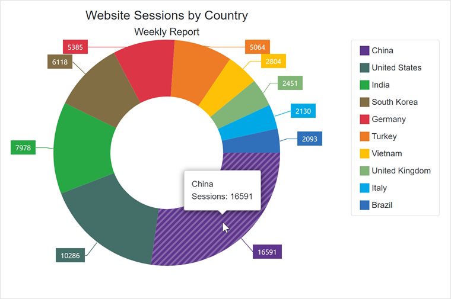

<!-- default badges list -->

<!-- default badges end -->

# Pie Chart for Blazor - Create a Pie Chart

This example demonstrates how to create a DevExpress Blazor PieChart, bind it to data, and customize the chart’s main settings (legend, labels, tooltips, etc.).

## Files to Look At

- [Index.razor](./CS/DxBlazorPieChartApp/Pages/Index.razor)

## Documentation

* [Get Started with the Pie Chart](https://docs.devexpress.com/Blazor/403704/charts/get-started-with-pie-charts)
* [DxPieChart<T> Class](https://docs.devexpress.com/Blazor/DevExpress.Blazor.DxPieChart-1)

## More Examples

* [How to implement a Theme Switcher in Blazor applications](https://github.com/DevExpress-Examples/blazor-theme-switcher)
* [Charts for Blazor - How to filter the chart based on DataGrid selection](https://github.com/DevExpress-Examples/blazor-Charts-how-to-filter-the-chart-based-on-DataGrid-selection)
<!-- feedback -->
## Does this example address your development requirements/objectives?

 

(you will be redirected to DevExpress.com to submit your response)
<!-- feedback end -->
